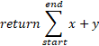

# Deamer project The multilingual language whitepaper
## What problem are we countering?

We all have had this problem in our coding life. We made a fantastic program in a certain language. But cannot use it in our new favorite language. Thus we need to port the old program or use other tools to hopefully integrate it in our systems.

Or the language that we are using doesn't have the same packages as you had in another language. We now need to find a compatible package in the current language or worse make it ourselves.

If it isn't clear what the problem is we are solving. We are solving the following:

'Language Limitations'


> By creating a language that supports every language we can use every advantage of each language to make coding perfect. - Thimo Böhmer

## Why use Deamer?

Why should I use Deamer?

- Faster and better integration
- New languages made with the Deamerproject have access to thousands of packages
- Interchangeable language useage (use c# here and continue with python)
- Great language for automation and development
- Rich API for language building

## What is the DeamerProject?

But what is Deamer or the Deamer project?

The Deamer project is a multi lingual compiler with as goal uniting every coding project out there. The meaning of this is the following:

- People can use languages interchangeably
- Use language specific advantages in combination with various other languages
- Code can be more readable and efficient
- Languages can use packages of other languages

Further more the DeamerProject also has a "main" language it uses to compile files. It uses: Deamer.

The compiler uses multiple compilers in combination with Deamer. Using the programming language (Deamer) the compiler can analyze and compile a variety of languages. All these languages are compiled to DeamerSub Bytecode.

## Motive for starting the DeamerProject

My motive of starting this program was the fact I wanted to combine my python program with my C# program. Without needing excess tools that partly changed the way I needed to write python or C#. I wanted them to form 1 whole program. This gave me the idea of starting the Deamer project.

The Deamer project consist of 1 language: Deamer. Deamer can read any language if he knows how to read it. Everything that Deamer reads is intepreted by how Deamer sees it. He will then compile it down.

This begs the second reason of creating the Deamer Project. I saw that a lot of things could be written more logically. That is why I wanted to design my own language: Deamer. Deamer has a lot of automation. With the automation we could write code even faster than python.

## Example programs

```Deamer
"C#" [
```

```c#
    int numTestA = 4;
    public int AddTwoNumbers(int a, int b)
    {
        return a + b;
    }
```

```Deamer
]
printf(numTestA) // Prints 4
"Python" [
```

```python
    print(numTestA) # Prints 4
    tmp = AddTwoNumbers(numTestA, 10)
    print(tmp) # Prints 14
```

```Deamer
]
```

In the previous example I showed how we could combine Deamer, C# and Python in one program. (We dont support both languages as this is a prototype).

Another example could be this:
```Deamer
"Python" [
```
```Python
	def complex_function(start, end, x, y):
```
```Deamer
	] "DeamMath" [
```
​							

```Deamer
	] "Python" [
	print(complex_function(0, 1, 1, 0)) # Prints 1
```
```Deamer
]
```

Note: I used a picture in the DeamMath code example as this better illustrates possible use cases.

### Ideas for IDE's

Ide's can "hide" compiler hints. This way code will be even more readable and cleaner. Example:

```Deamer
    int numTestA = 4;
    public int AddTwoNumbers(int a, int b)
    {
    	return a + b;
    }

printf(numTestA) // Prints 4

    print(numTestA) # Prints 4
    tmp = AddTwoNumbers(numTestA, 10)
    print(tmp) # Prints 14
```

## Roadmap

Current [Roadmap](https://github.com/Deruago/theDeamerProject/blob/master/ROADMAP.md)

## Copyright © 2020 by Thimo Böhmer
